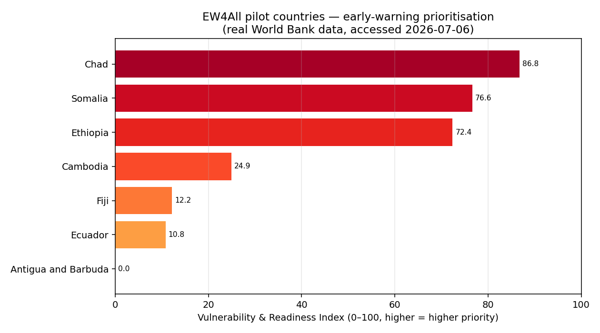
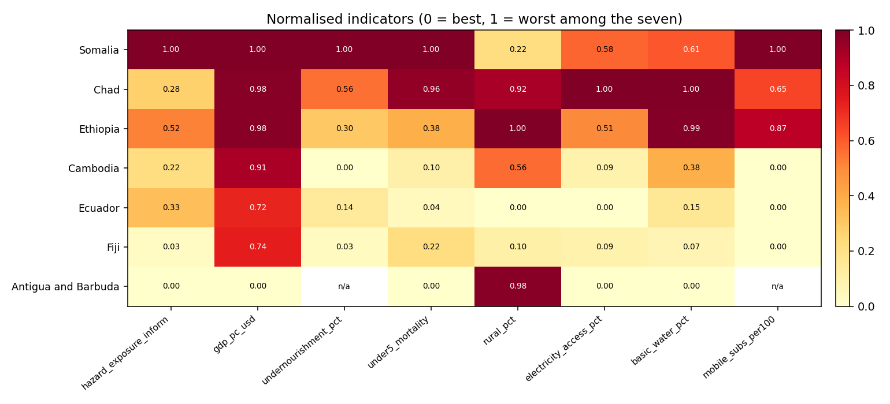
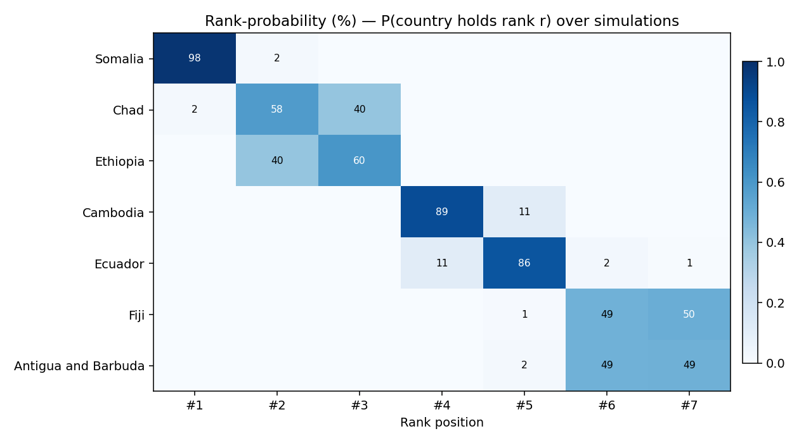
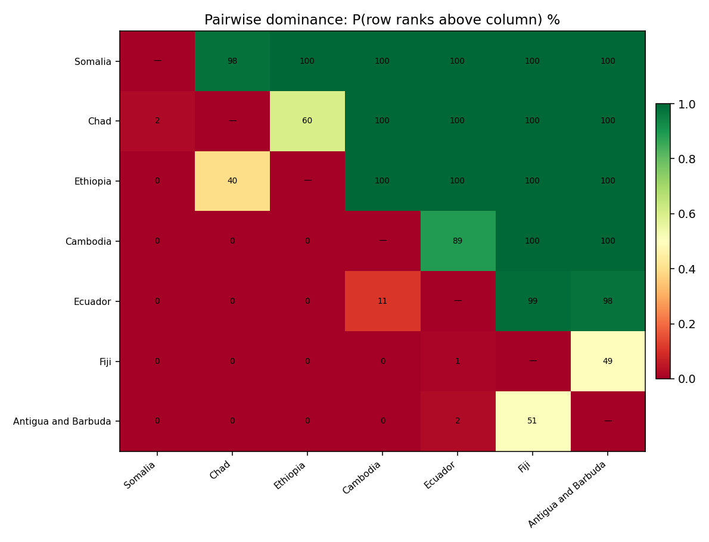
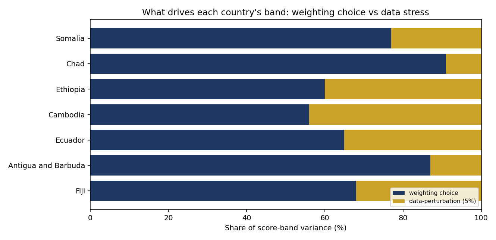
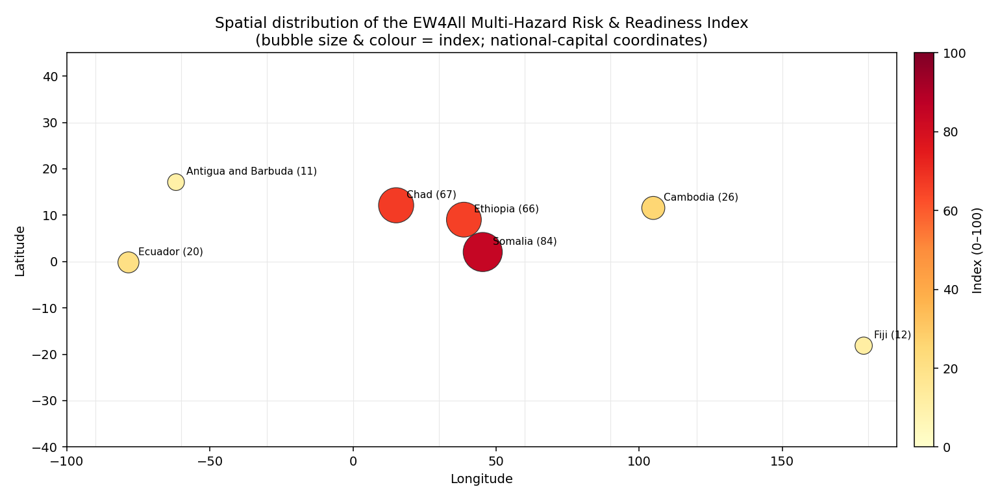

# EW4All Multi-Hazard Risk & Readiness Index

[](https://github.com/Pr0spektor/climate-risk-early-warning/actions/workflows/ci.yml)
[](https://colab.research.google.com/github/Pr0spektor/climate-risk-early-warning/blob/main/notebook.ipynb)
<!-- After the first GitHub release, replace with the Zenodo DOI badge (see RELEASING.md): -->
<!-- [](https://doi.org/10.5281/zenodo.XXXXXXX) -->
[](LICENSE)

A reproducible, real-data **Climate Risk & Vulnerability Assessment (CRVA)** for the seven Green
Climate Fund **Early Warnings for All (EW4All)** pilot countries — Antigua and Barbuda, Cambodia,
Chad, Ecuador, Ethiopia, Fiji and Somalia.

It addresses a central programme-prioritisation question: **where do high hazard and exposure, high
human vulnerability, and weak enabling systems (power, water, mobile reach) coincide — and therefore
where should early-warning investment be directed first?**

Every input is official open data, fetched live:

- **Hazard & Exposure** — [JRC INFORM Risk 2023](https://drmkc.jrc.ec.europa.eu/inform-index)
  (Hazard & Exposure component, 0–10).
- **Vulnerability & Readiness** — [World Bank Open Data](https://data.worldbank.org/)
  (GDP/capita, undernourishment, under-5 mortality, rural share; electricity, water, mobile reach).

Accessed 2026-07-06. Full indicator codes, years and URLs in [`data/sources.md`](data/sources.md).

## Result



| Rank | Country | Index (0–100) | Hazard | Vulnerability | Readiness gap | INFORM (ref) |
|---|---|---|---|---|---|---|
| 1 | Somalia | 84.4 | 1.00 | 0.80 | 0.73 | 8.9 |
| 2 | Chad | 67.1 | 0.28 | 0.86 | 0.88 | 6.5 |
| 3 | Ethiopia | 65.9 | 0.52 | 0.67 | 0.79 | 6.5 |
| 4 | Cambodia | 25.6 | 0.22 | 0.39 | 0.16 | 4.7 |
| 5 | Ecuador | 20.4 | 0.33 | 0.23 | 0.05 | 4.1 |
| 6 | Fiji | 11.9 | 0.03 | 0.27 | 0.05 | 2.9 |
| 7 | Antigua and Barbuda | 10.9 | 0.00 | 0.33 | 0.00 | 2.5 |

**Independent validation:** the ranking matches the JRC INFORM *overall* risk score — which is
**not** used in the composite — at a Spearman rank correlation of **ρ ≈ 0.99**. The two were
built from different inputs, so the agreement is a genuine cross-check, not circular.



### Robustness, rank-stability & sensitivity

Composite indicators are only decision-useful if we quantify how uncertain and how stable the
ranking is (per the OECD/JRC *Handbook on Constructing Composite Indicators*). A 20,000-run
Monte-Carlo simulation draws the three dimension weights from a Dirichlet distribution and
perturbs every normalised indicator with Gaussian noise.

Top-3 membership is essentially fixed here — the score gap from rank 3 to rank 4 (≈40 points) is
about **7× the ≈6-point spread**, so the leading group does not change. The decision-relevant
uncertainty lies *within* the groups, which the **full rank-probability** surface reveals:



- **Somalia is #1 in ≈98%** of simulations.
- **Chad vs Ethiopia trade ranks 2↔3** (Chad #2 ≈58% / #3 ≈40%) — a genuine near-tie.
- **Antigua vs Fiji are ≈50/50** for 6th/7th.

Pairwise dominance — P(row ranks above column) — makes the contested pairs explicit:



**Interpreting the score band.** The interval on each country's score is a *sensitivity band*, not
a statistical confidence interval — the indicators are census-style values, so there is no sampling
error. It quantifies how far a score could move under defensible alternative weightings and a 5%
data-perturbation stress. A variance decomposition shows the spread is **dominated by the weighting
choice** (91% for Chad), and is widest where a country's dimension profile is uneven: Chad scores
very high on vulnerability and readiness-gap but low on hazard, making its score weight-sensitive,
whereas Somalia — high on all three — is tightly constrained.



**Weight sensitivity** (sweeping each dimension's weight 0→0.8) and **structural robustness**
(Kendall's τ of the ranking under geometric vs arithmetic aggregation and z-score vs min-max
normalisation: **τ = 0.90–1.00**) confirm the ordering is stable to reasonable methodological
choices.

`src/uncertainty.py` → `results/{uncertainty,rank_stability,dominance_matrix,weight_sensitivity}.png`
+ `rank_stability.csv`, `structural_sensitivity.csv`. The dataset also carries the full **INFORM
component decomposition** (Hazard & Exposure, Vulnerability, Coping Capacity) for independent
comparison against the World-Bank-based dimensions.

### Spatial view

Spatial distribution of the index across the seven pilot countries (bubble size & colour = index;
national-capital coordinates). Demonstrates handling and visualisation of geospatial data — the
GIS step of a CRVA. Swap in GeoPandas + a shapefile for full-polygon choropleths.



## Method

Three INFORM-style dimensions, each from real open data:

- **Hazard & Exposure** — INFORM Risk 2023 Hazard & Exposure component.
- **Vulnerability** — GDP/capita (inverted), undernourishment, under-5 mortality, rural share
  (harder-to-reach populations).
- **Readiness gap** — access to electricity (inverted), basic drinking water (inverted), mobile
  subscriptions per 100 (inverted, capped at 100 = saturated reach — a proxy for how far a mobile
  warning can travel, EW4All Pillar 3).

Steps: set each indicator's polarity so higher = worse → min-max normalise 0–1 across the seven
countries → average the available indicators per dimension → composite =
**arithmetic mean of the three dimensions × 100** → rank. An arithmetic mean is used (rather than
a geometric mean) so a country that is best-in-class on one dimension is not forced to an
artificial 0. Missing values (Antigua's undernourishment and mobile figures) are left blank and
excluded from that country's dimension average — never imputed.

Index values are **relative across these seven countries** (a prioritisation tool), not absolute
global scores.

## How this maps to EW4All

| EW4All pillar | Lead agency | This repo |
|---|---|---|
| 1. Risk knowledge | UNDRR | hazard + vulnerability dimensions & country ranking |
| 2. Detection / monitoring | WMO | hazard dimension (INFORM) |
| 3. Warning dissemination | ITU | mobile-reach indicator in the readiness gap |
| 4. Preparedness & response | IFRC | readiness gap → where basic systems are weakest |

## Run it

```bash
pip install -r requirements.txt
python src/fetch_data.py      # re-fetch the latest real data from the World Bank + INFORM APIs
python src/build_index.py     # compute the index + write results/ charts and CSV
python src/spatial_map.py     # render the spatial (GIS-style) map of the index
python src/uncertainty.py     # Monte-Carlo robustness (rank-stability + sensitivity)
python src/rainfall_ew.py     # live ERA5 rainfall early-warning (flood/drought alerts)
```

### Live rainfall early-warning (ERA5)

`src/rainfall_ew.py` fetches **real ERA5 reanalysis rainfall** (Open-Meteo, no key) for each pilot
capital and fires **flood** alerts (rolling 3-day accumulation above the site's own p95/p99) and
**drought** flags (consecutive dry-day runs). Thresholds self-calibrate to each site's climatology,
so the method transfers from the Sahel to the Pacific unchanged — a working detection layer for
EW4All Pillars 2–3. Data is pulled live at run time; `python src/rainfall_ew.py --selftest`
validates the alert logic offline.

Or open the notebook in Google Colab via the badge above (zero setup).

## Tests & CI
`pytest -q` runs a suite covering normalisation polarity/bounds, the no-imputation rule for missing
values, index bounds and the expected priority ordering, and agreement with the independent INFORM
score (Spearman ρ ≥ 0.9). GitHub Actions runs the tests plus the index and robustness scripts on
every push (`.github/workflows/ci.yml`).

## Repository layout

```
climate-risk-early-warning/
├── data/
│   ├── worldbank_indicators.csv   # real values (committed snapshot, accessed 2026-07-06)
│   └── sources.md                 # indicator codes, years, definitions, limitations
├── src/
│   ├── fetch_data.py              # live fetch from World Bank + JRC INFORM APIs
│   ├── build_index.py             # computes index + charts + validation
│   ├── spatial_map.py             # geospatial (GIS-style) map of the index
│   ├── uncertainty.py             # Monte-Carlo robustness / sensitivity analysis
│   └── rainfall_ew.py             # live ERA5 rainfall flood/drought early-warning
├── results/
│   ├── index.csv
│   ├── index_ranking.png
│   ├── indicator_heatmap.png
│   ├── index_map.png
│   ├── uncertainty.png            # sensitivity band (not a statistical CI)
│   ├── uncertainty_sources.png    # variance: weighting vs data-perturbation
│   ├── rank_stability.png/.csv    # P(country holds rank r)
│   ├── dominance_matrix.png       # P(row ranks above column)
│   ├── weight_sensitivity.png     # one-at-a-time weight sweeps
│   ├── structural_sensitivity.csv # Kendall τ across method variants
│   └── uncertainty.csv
├── tests/                        # pytest suite (normalisation, ranking, INFORM validation)
├── .github/workflows/            # CI (tests + index/robustness on every push)
├── notebook.ipynb
├── requirements.txt
└── LICENSE
```

## Data & licence

World Bank data © World Bank ([CC BY 4.0](https://data.worldbank.org/)). INFORM Risk © European
Commission Joint Research Centre / INFORM. Code released under the MIT Licence.
